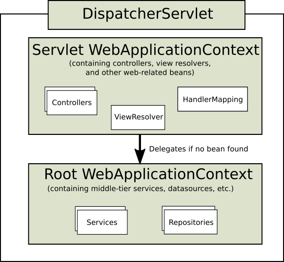

## 1.1. DispatcherServlet

与许多其他web框架一样，Spring MVC是围绕前端控制器模式设计的，其中一个中心Servlet DispatcherServlet为请求处理提供了共享算法，而实际工作是由可配置的委托组件执行的。该模型非常灵活，支持多种工作流程。

DispatcherServlet和任何Servlet一样，需要使用Java配置或web.xml根据Servlet规范声明和映射。反过来，DispatcherServlet使用Spring配置来发现请求映射、视图解析、异常处理等所需的委托组件。

下面的Java配置示例注册并初始化DispatcherServlet，它由Servlet容器自动检测(参见Servlet配置):

```java
public class MyWebApplicationInitializer implements WebApplicationInitializer {

    @Override
    public void onStartup(ServletContext servletContext) {

        // Load Spring web application configuration
        AnnotationConfigWebApplicationContext context = new AnnotationConfigWebApplicationContext();
        context.register(AppConfig.class);

        // Create and register the DispatcherServlet
        DispatcherServlet servlet = new DispatcherServlet(context);
        ServletRegistration.Dynamic registration = servletContext.addServlet("app", servlet);
        registration.setLoadOnStartup(1);
        registration.addMapping("/app/*");
    }
}
```

> 除了直接使用ServletContext API，您还可以扩展AbstractAnnotationConfigDispatcherServletInitializer并覆盖特定的方法(请参阅context层次结构下的示例)。

> 对于编程用例，可以使用GenericWebApplicationContext替代AnnotationConfigWebApplicationContext。详细信息请参见GenericWebApplicationContext javadoc。

下面的web.xml配置示例注册并初始化DispatcherServlet:

```xml
<web-app>

    <listener>
        <listener-class>org.springframework.web.context.ContextLoaderListener</listener-class>
    </listener>

    <context-param>
        <param-name>contextConfigLocation</param-name>
        <param-value>/WEB-INF/app-context.xml</param-value>
    </context-param>

    <servlet>
        <servlet-name>app</servlet-name>
        <servlet-class>org.springframework.web.servlet.DispatcherServlet</servlet-class>
        <init-param>
            <param-name>contextConfigLocation</param-name>
            <param-value></param-value>
        </init-param>
        <load-on-startup>1</load-on-startup>
    </servlet>

    <servlet-mapping>
        <servlet-name>app</servlet-name>
        <url-pattern>/app/*</url-pattern>
    </servlet-mapping>

</web-app>
```

> Spring Boot遵循不同的初始化顺序。Spring Boot没有与Servlet容器的生命周期挂钩，而是使用Spring配置来引导自身和嵌入的Servlet容器。Filter和Servlet声明在Spring配置中检测到，并注册到Servlet容器中。要了解更多细节，请参阅Spring Boot文档。

### 1.1.1. context层次结构

 DispatcherServlet需要一个WebApplicationContext(普通ApplicationContext的扩展)来进行它自己的配置。WebApplicationContext有一个到ServletContext和与之相关联的Servlet的链接。它还被绑定到ServletContext，以便应用程序在需要访问WebApplicationContext时可以使用requestcontexttutils上的静态方法来查找它。

对于许多应用程序来说，拥有一个单独的WebApplicationContext就足够了。也可以有一个context层次结构，其中一个根WebApplicationContext跨多个DispatcherServlet(或其他Servlet)实例共享，每个实例都有自己的子WebApplicationContext配置。有关context层次结构特性的更多信息，请参阅ApplicationContext的附加功能。

根WebApplicationContext通常包含基础设施bean，例如需要跨多个Servlet实例共享的数据存储库和业务服务。这些bean被有效地继承，并且可以在特定于Servlet的子WebApplicationContext中被重写(即重新声明)，该子WebApplicationContext通常包含给定Servlet的本地bean。下图显示了这种关系:



下面的例子配置了一个WebApplicationContext层次结构:

```java
public class MyWebAppInitializer extends AbstractAnnotationConfigDispatcherServletInitializer {

    @Override
    protected Class<?>[] getRootConfigClasses() {
        return new Class<?>[] { RootConfig.class };
    }

    @Override
    protected Class<?>[] getServletConfigClasses() {
        return new Class<?>[] { App1Config.class };
    }

    @Override
    protected String[] getServletMappings() {
        return new String[] { "/app1/*" };
    }
}
```

> 说明
>
> 如果不需要应用程序上下文层次结构，应用程序可以通过getRootConfigClasses()返回所有配置，并从getServletConfigClasses()返回null。

下面的例子展示了web.xml的等效内容:

```xml
<web-app>

    <listener>
        <listener-class>org.springframework.web.context.ContextLoaderListener</listener-class>
    </listener>

    <context-param>
        <param-name>contextConfigLocation</param-name>
        <param-value>/WEB-INF/root-context.xml</param-value>
    </context-param>

    <servlet>
        <servlet-name>app1</servlet-name>
        <servlet-class>org.springframework.web.servlet.DispatcherServlet</servlet-class>
        <init-param>
            <param-name>contextConfigLocation</param-name>
            <param-value>/WEB-INF/app1-context.xml</param-value>
        </init-param>
        <load-on-startup>1</load-on-startup>
    </servlet>

    <servlet-mapping>
        <servlet-name>app1</servlet-name>
        <url-pattern>/app1/*</url-pattern>
    </servlet-mapping>

</web-app>
```

> 说明
>
> 如果不需要应用程序上下文层次结构，应用程序可以只配置“根”上下文，并将contextConfigLocation Servlet参数保留为空。

### 1.1.2. 特殊的Bean类型

DispatcherServlet委托给特殊的bean来处理请求并呈现适当的响应。所谓“特殊bean”，我们指的是实现框架契约的spring管理的Object实例。它们通常带有内置契约，但您可以自定义它们的属性并扩展或替换它们。

下表列出了DispatcherServlet检测到的特殊bean:

 

| Bean类型                                                     | 说明                                                         |
| ------------------------------------------------------------ | ------------------------------------------------------------ |
| HandlerMapping                                               | 将一个请求映射到一个处理程序，以及用于预处理和后处理的拦截器列表。映射基于一些标准，具体细节因HandlerMapping实现而异。<br/><br/>两个主要的HandlerMapping实现是RequestMappingHandlerMapping(它支持@RequestMapping注解方法)和SimpleUrlHandlerMapping(它维护URI路径模式到处理程序的显式注册)。 |
| HandlerAdapter                                               | 帮助DispatcherServlet调用映射到请求的处理程序，而不管处理程序实际是如何调用的。例如，调用带注解的控制器需要解析注解。HandlerAdapter的主要目的是保护DispatcherServlet不受这些细节的影响。 |
| [`HandlerExceptionResolver`](https://docs.spring.io/spring-framework/docs/current/reference/html/web.html#mvc-exceptionhandlers) | 策略来解决异常，可能将它们映射到处理程序、HTML错误视图或其他目标。 |
| [`ViewResolver`](https://docs.spring.io/spring-framework/docs/current/reference/html/web.html#mvc-viewresolver) | 将从处理程序返回的基于逻辑字符串的视图名称解析为要呈现给响应的实际视图。参见视图分辨率和视图技术。 |
| [`LocaleResolver`](https://docs.spring.io/spring-framework/docs/current/reference/html/web.html#mvc-localeresolver), [LocaleContextResolver](https://docs.spring.io/spring-framework/docs/current/reference/html/web.html#mvc-timezone) | 解析客户端正在使用的Locale，可能还有他们的时区，以便能够提供国际化的视图。看地区。 |
| [`ThemeResolver`](https://docs.spring.io/spring-framework/docs/current/reference/html/web.html#mvc-themeresolver) | 解析您的web应用程序可以使用的主题——例如，提供个性化布局。看到主题。 |
| [`MultipartResolver`](https://docs.spring.io/spring-framework/docs/current/reference/html/web.html#mvc-multipart) | 在一些多部分解析库的帮助下解析多部分请求(例如，浏览器表单文件上传)的抽象。 |
| [`FlashMapManager`](https://docs.spring.io/spring-framework/docs/current/reference/html/web.html#mvc-flash-attributes) | 存储和检索“输入”和“输出”FlashMap，可用于将属性从一个请求传递到另一个请求，通常是通过重定向。 |

### 1.1.3. web mvc 配置

应用程序可以声明特殊Bean类型中列出的处理请求所需的基础设施Bean。DispatcherServlet为每个特殊的bean检查WebApplicationContext。如果没有匹配的bean类型，它将退回到DispatcherServlet.properties中列出的默认类型。

在大多数情况下，MVC配置是最好的起点。它用Java或XML声明所需的bean，并提供高级配置回调API来自定义它。

> Spring Boot依赖于MVC Java配置来配置Spring MVC，并提供了许多额外的方便选项。

### 1.1.4. Servlet 配置

在Servlet 3.0+环境中，您可以选择以编程方式配置Servlet容器作为备选方案，或者与web.xml文件结合使用。下面的例子注册了一个DispatcherServlet:

```java
import org.springframework.web.WebApplicationInitializer;

public class MyWebApplicationInitializer implements WebApplicationInitializer {

    @Override
    public void onStartup(ServletContext container) {
        XmlWebApplicationContext appContext = new XmlWebApplicationContext();
        appContext.setConfigLocation("/WEB-INF/spring/dispatcher-config.xml");

        ServletRegistration.Dynamic registration = container.addServlet("dispatcher", new DispatcherServlet(appContext));
        registration.setLoadOnStartup(1);
        registration.addMapping("/");
    }
}
```

WebApplicationInitializer是Spring MVC提供的一个接口，它确保检测到您的实现并自动用于初始化任何Servlet 3容器。WebApplicationInitializer的抽象基类实现名为AbstractDispatcherServletInitializer，通过覆盖指定servlet映射和DispatcherServlet配置位置的方法，使注册DispatcherServlet更加容易。

这对于使用基于java的Spring配置的应用程序是推荐的，如下面的示例所示:

```java
public class MyWebAppInitializer extends AbstractAnnotationConfigDispatcherServletInitializer {

    @Override
    protected Class<?>[] getRootConfigClasses() {
        return null;
    }

    @Override
    protected Class<?>[] getServletConfigClasses() {
        return new Class<?>[] { MyWebConfig.class };
    }

    @Override
    protected String[] getServletMappings() {
        return new String[] { "/" };
    }
}
```

如果您使用基于xml的Spring配置，您应该直接从AbstractDispatcherServletInitializer扩展，如下面的示例所示:

```java
public class MyWebAppInitializer extends AbstractDispatcherServletInitializer {

    @Override
    protected WebApplicationContext createRootApplicationContext() {
        return null;
    }

    @Override
    protected WebApplicationContext createServletApplicationContext() {
        XmlWebApplicationContext cxt = new XmlWebApplicationContext();
        cxt.setConfigLocation("/WEB-INF/spring/dispatcher-config.xml");
        return cxt;
    }

    @Override
    protected String[] getServletMappings() {
        return new String[] { "/" };
    }
}
```

AbstractDispatcherServletInitializer还提供了一种方便的方法来添加Filter实例，并让它们自动映射到DispatcherServlet，如下面的示例所示:

```java
public class MyWebAppInitializer extends AbstractDispatcherServletInitializer {

    // ...

    @Override
    protected Filter[] getServletFilters() {
        return new Filter[] {
            new HiddenHttpMethodFilter(), new CharacterEncodingFilter() };
    }
}
```

每个筛选器都会根据其具体类型添加一个默认名称，并自动映射到DispatcherServlet。

AbstractDispatcherServletInitializer的isAsyncSupported受保护方法提供了一个单独的位置，用于在DispatcherServlet和映射到它的所有过滤器上启用异步支持。默认情况下，该标志被设置为true。

最后，如果您需要进一步定制DispatcherServlet本身，您可以重写createDispatcherServlet方法。

### 1.1.5 处理

DispatcherServlet处理请求如下:

- 在请求中搜索WebApplicationContext并将其绑定为控制器和流程中的其他元素可以使用的属性。它默认绑定在DispatcherServlet.WEB_APPLICATION_CONTEXT_ATTRIBUTE属性中。
- 区域设置解析器被绑定到请求，以让流程中的元素解析处理请求时使用的区域设置(呈现视图、准备数据等)。如果不需要区域设置解析，则不需要区域设置解析器。
- 主题解析器被绑定到请求，以让视图等元素决定使用哪个主题。如果不使用主题，可以忽略它。
- 如果指定了多部分文件解析器，则将对请求进行多部分检查。如果发现了多个部分，则将请求包装在MultipartHttpServletRequest中，以供流程中的其他元素进一步处理。有关多部分处理的更多信息，请参见多部分解析器。
- 搜索合适的处理程序。如果找到一个处理程序，则运行与该处理程序(预处理器、后处理器和控制器)相关联的执行链，以准备一个用于呈现的模型。另外，对于带注释的控制器，可以呈现响应(在HandlerAdapter中)，而不是返回视图。
- 如果返回模型，则呈现视图。如果没有返回模型(可能是由于预处理器或后处理器拦截了请求，也可能是出于安全原因)，则不会呈现视图，因为请求可能已经被满足了。

在WebApplicationContext中声明的HandlerExceptionResolver bean用于解决请求处理期间抛出的异常。这些异常解析器允许自定义处理异常的逻辑。有关更多详细信息，请参见异常。

对于HTTP缓存支持，处理程序可以使用WebRequest的checkNotModified方法，以及在控制器的HTTP缓存中描述的注解控制器的进一步选项。

通过在web.xml文件中的Servlet声明中添加Servlet初始化参数(init-param元素)，您可以自定义各个DispatcherServlet实例。支持的参数如下表所示:

| 参数                           | 说明                                                         |
| ------------------------------ | ------------------------------------------------------------ |
| contextClass                   | 实现ConfigurableWebApplicationContext的类，由这个Servlet实例化并在本地配置。默认情况下，使用XmlWebApplicationContext。 |
| contextConfigLocation          | 传递给上下文实例(由contextClass指定)的字符串，以指示在何处可以找到上下文。字符串可能由多个字符串(使用逗号作为分隔符)组成，以支持多个上下文。在定义两次bean的多个上下文位置的情况下，最新的位置优先。 |
| namespace                      | WebApplicationContext的命名空间。默认为servlet-name servlet。 |
| throwExceptionIfNoHandlerFound | 当没有为请求找到处理程序时，是否抛出NoHandlerFoundException。然后，可以使用HandlerExceptionResolver捕获异常(例如，通过使用@ExceptionHandler控制器方法)并像处理其他异常一样处理异常。<br/><br/>默认情况下，这被设置为false，在这种情况下，DispatcherServlet将响应状态设置为404 (NOT_FOUND)，而不会引发异常。<br/><br/>注意，如果还配置了默认的servlet处理，未解析的请求总是被转发到默认的servlet，而不会引发404。 |

### 1.1.6. 路径匹配

Servlet API将完整的请求路径公开为requestURI，并进一步将其细分为contextPath、servletPath和pathInfo，它们的值根据Servlet的映射方式而变化。从这些输入中，Spring MVC需要确定用于处理程序映射的查找路径，这是DispatcherServlet本身映射中的路径，不包括contextPath和任何servletMapping前缀(如果存在的话)。

servletPath和pathInfo是经过解码的，这使得它们不可能直接与完整的requestURI进行比较，以派生lookupath，这使得有必要解码requestURI。然而，这也带来了自己的问题，因为路径可能包含编码的保留字符，如"/"或";"，这些字符在被解码后又会改变路径的结构，这也会导致安全问题。此外，Servlet容器可能会对servletPath进行不同程度的规范化，这使得它进一步不可能对requestURI执行startsWith比较。

这就是为什么最好避免依赖于基于前缀的servletPath映射类型附带的servletPath。如果DispatcherServlet被映射为默认的Servlet，带有“/”或者不带“/*”前缀，并且Servlet容器是4.0+，那么Spring MVC能够检测Servlet映射类型，并避免使用servletPath和pathInfo。在3.1 Servlet容器中，假设相同的Servlet映射类型，可以通过在MVC配置中通过路径匹配提供一个带有alwaysUseFullPath=true的UrlPathHelper来实现等价的功能。

幸运的是，默认的Servlet映射“/”是一个很好的选择。然而，仍然存在一个问题，即需要对requestURI进行解码，以便能够与控制器映射进行比较。这也是不可取的，因为有可能解码改变路径结构的保留字符。如果不需要这样的字符，那么您可以拒绝它们(像Spring Security HTTP防火墙)，或者您可以用urlDecode=false配置UrlPathHelper，但控制器映射将需要与已编码的路径匹配，这可能并不总是工作良好。此外，有时DispatcherServlet需要与另一个Servlet共享URL空间，可能需要通过前缀进行映射。

通过从PathMatcher切换到5.3或更高版本中可用的经过解析的PathPattern，可以更全面地解决上述问题，请参阅模式比较。与需要解码查找路径或编码控制器映射的AntPathMatcher不同，解析后的PathPattern匹配名为RequestPath的路径解析表示，每次匹配一个路径段。这允许单独解码和清除路径段值，而不会有改变路径结构的风险。Parsed PathPattern还支持使用servletPath前缀映射，只要前缀保持简单，并且不包含任何需要编码的字符。

### 1.1.7. 拦截


